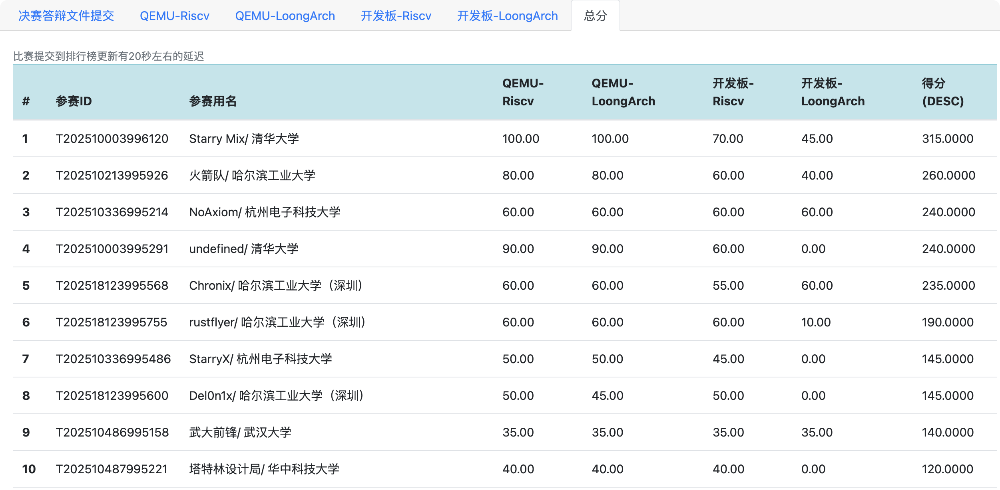
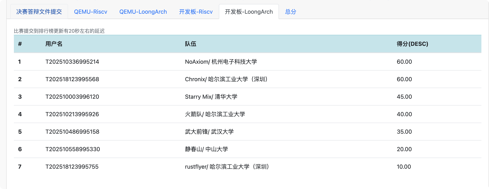
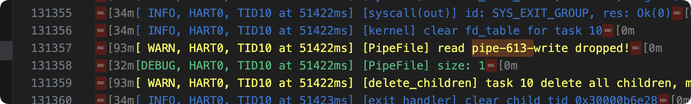

# 杭州电子科技大学-NoAxiom队

## 总体完成情况



NoAxiom OS在2025年全国大学生系统能力大赛OS赛道现场赛中，成功完成了绝大部分测试点，在不同架构的qemu虚拟环境与物理上板环境下均取得了60分的成绩，在跨平台运行场景下体现了卓越稳定性。总体排名第三。

具体得分如下所示。

| 题目              | 小题             | 分值 | 完成状态 | 技术难点                      |
| ----------------- | ---------------- | ---- | -------- | ----------------------------- |
| 第一题：git功能   | 1.1 git -h       | 5分  | ✅ 完成   | 程序加载与执行                |
|                   | 1.2 文件系统相关 | 20分 | ✅ 完成   | 链接文件、文件时间戳、TTY显示 |
|                   | 1.3 网络相关     | 30分 | ❌ 未完成 | 网络协议栈实现                |
| 第二题：vim功能   | 2.1 vim -h       | 5分  | ✅ 完成   | 程序加载与执行                |
|                   | 2.2 vim编辑      | 10分 | ✅ 完成   | TTY设备优化、ioctl支持        |
| 第三题：gcc功能   | 3.1 gcc --h      | 5分  | ✅ 完成   | 程序加载与执行                |
|                   | 3.2 编译运行     | 10分 | ✅ 完成   | 动态链接库支持                |
| 第四题：rustc功能 | 4.1 rustc -h     | 5分  | ✅ 完成   | 程序加载与执行                |
|                   | 4.2 编译运行     | 10分 | ❌ 未完成 | Socket与Pipe协同支持          |

## 核心优势

### 多平台稳定性

NoAxiom在LS2k1000上板测试当中获得了60分的成绩，位列全部队伍中的第一名。虚拟环境通过即物理环境通过，很好地体现了NoAxiomOS在物理环境下的卓越稳定性。

为了有效实现多平台下的稳定迁移，NoAxiom设计了独属于自己操作系统的HAL层，即NoAxiomHAL，通过层层解耦将硬件实现细节与操作系统内核实现相解耦，这在我们的现场比赛中发挥了重大作用。我们通过HAL层中的driver驱动子模块，将2k1000下的ahci_driver库与内核彻底解耦，并良好实现了驱动所需的内存分配、地址转换等功能，最终成功上板运行m.2 sata设备。

同时，我们对于2k1000特殊的指令支持情况也做了适配。2k1000下不支持48位地址，不支持非对齐访存，异常入口基址强制要求按页对齐。对于这些特殊硬件体质，我们均进行了适配。这些功能均集成在了NoAxiomHAL中，使得我们开发过程中完全可以无视硬件环境进行功能调整，为我们现场开发节省了大量工作量。

最终我们在la上板测试中，成为第一个上板拿到最高分60的队伍。



### 文件系统缓存一致性

NoAxiom在文件系统中设计了自下而上的多缓存结构，大幅提高了文件系统I/O性能。在这样的缓存结构下，需要实现一致性管理以及对磁盘的持久化写入，是一个不小的挑战。

NoAxiom通过合理的页缓存动态sync策略以及块缓存的LRU替换策略，在实现高效I/O的基础上，同样保证了文件系统的缓存一致性以及稳定性，保证最终在QEMU和上板环境下取得相同的结果。

## NoAxiom OS 现场赛技术实现报告

### 主要技术挑战与解决方案

1. **链接文件支持**
   - **主要挑战**：
     - 在git、gcc以及rustc测试点中涉及大量动态链接库的使用，而初期内核对链接文件的支持不足，导致无法正确加载这些库
   - **技术要点**：
     - 在NoAxiom OS中全面支持硬链接（hard link）和软链接（symbolic link）
     - 遇到某些测例需要用的动态链接库，而镜像中未存在，我们便通过符号链接的方式将其引入
     - 全面支持链接文件的递归解析和路径解析，以下是核心的路径解析和链接

```rust
/// walk through the path, return ENOENT when not found.
/// follow the symlink at a limited time use recursion
pub fn walk_path(
    self: &Arc<Self>,
    task: &Arc<Task>,
    path: &Vec<&str>,
) -> SysResult<Arc<dyn Dentry>> {
    Ok(self.__walk_path(Some(task), path, 0, 0)?.0)
}

pub fn walk_path_no_checksearch(
    self: &Arc<Self>,
    path: &Vec<&str>,
) -> SysResult<Arc<dyn Dentry>> {
    Ok(self.__walk_path(None, path, 0, 0)?.0)
}

/// Must ensure the inode has symlink
/// symlink jump, follow the symlink path
pub fn symlink_jump(
    self: &Arc<Self>,
    task: &Arc<Task>,
    symlink_path: &str,
) -> SysResult<Arc<dyn Dentry>> {
    Ok(self.__symlink_jump(Some(task), symlink_path, 0)?.0)
}

fn __symlink_jump(
    self: &Arc<Self>,
    task: Option<&Arc<Task>>,
    symlink_path: &str,
    jumps: usize,
) -> SysResult<(Arc<dyn Dentry>, usize)> {
    let abs = symlink_path.starts_with('/');
    let components = path::resolve_path(symlink_path)?;
    let res = if abs {
        root_dentry().__walk_path(task, &components, 0, jumps)
    } else {
        self.parent()
            .expect("must have parent")
            .__walk_path(task, &components, 0, jumps)
    };
    match res {
        Ok((dentry, new_jumps)) => {
            if let Ok(inode) = dentry.inode() {
                if let Some(symlink_path) = inode.symlink() {
                    debug!("[__symlink_jump] Following symlink: {}", symlink_path);
                    return dentry.__symlink_jump(task, &symlink_path, jumps + 1);
                }
            }
            Ok((dentry, new_jumps))
        }
        Err(e) => Err(e),
    }
}

fn __walk_path(
    self: &Arc<Self>,
    task: Option<&Arc<Task>>,
    path: &Vec<&str>,
    step: usize,
    jumps: usize,
) -> SysResult<(Arc<dyn Dentry>, usize)> {
    const SYMLINK_MAX_STEP: usize = 12;
    if unlikely(jumps >= SYMLINK_MAX_STEP) {
        error!("[walk_path] symlink too many times, jumps: {}", jumps);
        return Err(Errno::ELOOP);
    }
    if step == path.len() {
        return Ok((self.clone(), jumps));
    }
    if unlikely(self.is_negative()) {
        error!("[walk_path] {} is negative", self.name());
        return Err(Errno::ENOENT);
    }

    let inode = self.inode().expect("should have inode!");

    let entry = path[step];
    match entry {
        "." => self.__walk_path(task, path, step + 1, jumps),
        ".." => {
            if let Some(parent) = self.parent() {
                parent.__walk_path(task, path, step + 1, jumps)
            } else {
                error!("[walk_path] {} has no parent", self.name());
                Err(Errno::ENOENT)
            }
        }
        name => {
            if let Some(symlink_path) = inode.symlink() {
                let (tar, new_jumps) = self.__symlink_jump(task, &symlink_path, jumps + 1)?;
                return tar.__walk_path(task, path, step, new_jumps);
            }
            // Check if this is a directory BEFORE checking permissions
            // This ensures ENOTDIR takes precedence over EACCES
            if inode.file_type() != InodeMode::DIR {
                error!("[walk_path] {} is not a dir", self.name());
                return Err(Errno::ENOTDIR);
            }

            // Only check search permissions after confirming it's a directory
            if let Some(task) = task {
                if task.user_id().fsuid() != 0 {
                    if unlikely(!self.can_search(task)) {
                        error!("[walk_path] has no search access");
                        return Err(Errno::EACCES);
                    }
                }
            }
            if let Some(child) = self.get_child(name) {
                return child.__walk_path(task, path, step + 1, jumps);
            }
            match self.clone().open(&FileFlags::empty()) {
                Ok(file) => {
                    assert_no_lock!();
                    block_on(file.load_dir()).expect("can not load dir!");
                }
                Err(e) => {
                    return Err(Errno::ENOENT);
                }
            }
            if let Some(child) = self.get_child(name) {
                return child.__walk_path(task, path, step + 1, jumps);
            }
            Err(Errno::ENOENT)
        }
    }
}
```

2. **文件元信息的维护**
   - **主要挑战**：
     - 执行`git add`时发现无文件添加到暂存区，并且git删除了临时创建的`index.lock`文件
     - Debug难度大，git本身不支持Debug，导致出现隐性错误时无法快速定位解决
   - **技术要点**：
     - 通过深入测试源码，加入调试日志，重新编译并打包为镜像，进而进行调试和错误定位
     - 正确维护文件的（`atime`, `mtime`, `ctime`）信息，确保`stat`系统调用可以发现文件的时间戳更新

3. **TTY设备驱动优化**
   - **主要挑战**：
     - Vim测试点对终端设备提出了很高的要求，需要复杂的终端控制功能
   - **技术要点**：
     - 实现`ioctl`调用支持窗口尺寸获取（TIOCGWINSZ）
     - 支持终端模式切换（canonical/non-canonical mode）
     - 实现一些特殊字符的处理

4. **Unix Domain Socket**
   - **主要挑战**：
     - Rustc可以启动运行，但最终会显示rust核心程序panic
     - 通过Debug日志调试，我们最终发现使用pipe行为的socketpair系统调用，导致后续出现了pipe的读写端异常的bug，因时间有限，在现场赛结尾时才发现此bug，没有时间继续调试，bug示意如下
     

